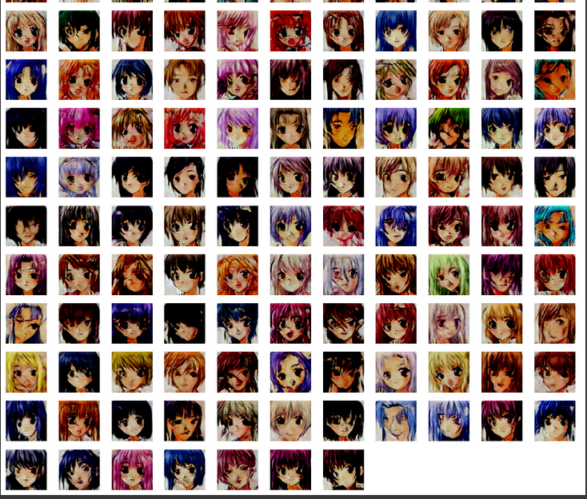

# DCGAN with Self-Attention: Generating Anime Images using DCGAN with Self-Attention Mechanism



This repository contains an implementation of a Deep Convolutional Generative Adversarial Network (DCGAN) with self-attention mechanism for generating anime-style images. The model is trained on the Anime Image dataset to produce high-quality anime-like illustrations.

## Dataset
The Anime Image dataset used in this project can be found [here](https://www.kaggle.com/datasets/splcher/animefacedataset/data). It consists of over 10,000 high-resolution anime images, which are utilized to train the DCGAN model.

## Dependencies
- Python 3.x
- PyTorch
- torchvision
- NumPy
- Matplotlib

## Usage
1. Clone the repository:
   ```bash
   git clone https://github.com/BoppaniSuresh/DCGANwithAttention.git

2. Navigate to the project directory: cd DCGANwithAttention
   
3. Install dependencies: pip install -r requirements.txt

4. Train the DCGAN model with self-attention

5. Generate new anime images using the trained model

##Results

Sample generated images will be available in the `result.png`.

Implementation Details

This implementation of DCGAN with self-attention mechanism introduces self-attention blocks within the generator and discriminator architectures. The self-attention mechanism helps the model focus on important regions of the input images during both generation and discrimination processes, leading to improved image quality and stability during training.

Feel free to contribute, report issues, or suggest improvements!
